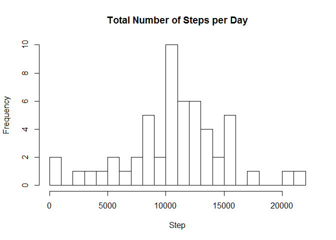
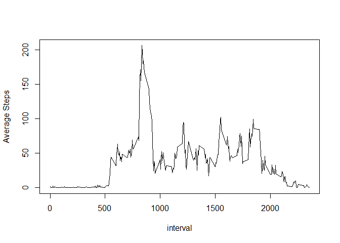
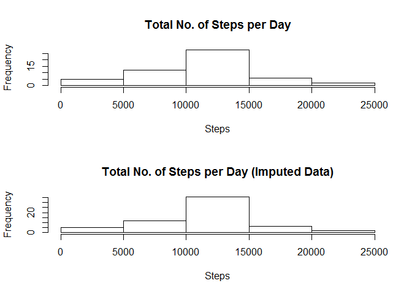
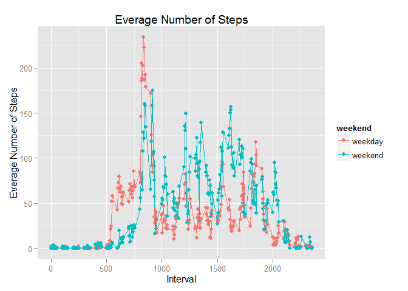
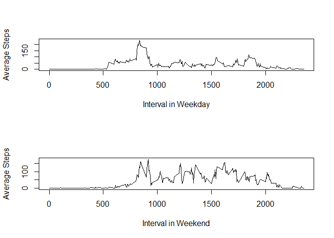

# Rmarkdown file for RR Project 1

## Set options

```r
library(knitr)
opts_chunk$set(echo=TRUE,results="markup")
```

### Loading and preprocessing the data
Read data file from url "https://d396qusza40orc.cloudfront.net/repdata%2Fdata%2Factivity.zip"


```r
#download.file("https://d396qusza40orc.cloudfront.net/repdata%2Fdata%2Factivity.zip", "./Activity.zip")
unzip("Activity.zip")
df<-read.csv("Activity.csv") #load data as data fram df
```

### What is mean total number of steps taken per day?

```r
aggdf<-aggregate(steps~date,data=df,FUN=sum,na.rm=T, na.action = na.omit)
hist(aggdf$steps,25,main="Total Number of Steps per Day",xlab="Step")
```

 

```r
(summary(aggdf$steps))
```

```
##    Min. 1st Qu.  Median    Mean 3rd Qu.    Max. 
##      41    8841   10760   10770   13290   21190
```

The histogram of the total number of steps taken each day is roughly bell shaped and the center is around 10000.

The mean and median total number of steps taken per day are 10770 and 10760, respectively.

### What is the average daily activity pattern?


```r
aggdf2<-aggregate(steps~interval,data=df,FUN=mean, na.action = na.omit)
plot.ts(aggdf2$interval,aggdf2$steps,type="l",xlab="interval", ylab="Average Steps")
```

 

```r
aggdf2[which.max(aggdf2$steps),"interval"]
```

```
## [1] 835
```

The time series plot shows the very high peak around 800 ~ 1000 5-minitues interval, and the interval 835 contains the maximum number of steps on average.

### Imputing missing values


```r
sum(is.na(df$steps))
```

```
## [1] 2304
```

```r
df2<-df
for (itv in unique(df2[is.na(df2$steps),"interval"])){
  #df[df$interval==itv,"steps"]
  df2[df2$interval==itv & is.na(df2$steps),"steps"]<-floor(mean(df2[df2$interval==itv,"steps"],na.rm=T))
  }
(sum(is.na(df2$steps)))
```

```
## [1] 0
```

```r
aggdf2<-aggregate(steps~date,data=df2,FUN=sum,na.rm=T, na.action = na.omit)
par(mfrow=c(2,1))
hist(aggdf$steps,main="Total No. of Steps per Day",xlab="Steps")
hist(aggdf2$steps,main="Total No. of Steps per Day (Imputed Data)",xlab="Steps")
```

 

```r
(summary(aggdf$steps))
```

```
##    Min. 1st Qu.  Median    Mean 3rd Qu.    Max. 
##      41    8841   10760   10770   13290   21190
```

```r
(summary(aggdf2$steps))
```

```
##    Min. 1st Qu.  Median    Mean 3rd Qu.    Max. 
##      41    9819   10640   10750   12810   21190
```


There are slightly decreases in both mean (10770 vs 10750) and median (10760 vs 010640) after impuation, while the pattern of the histogram still keeps.


```r
df3<-df
df3$weekday<-weekdays(as.Date(df3$date))
df3$weekend<-ifelse((df3$weekday %in% c("Saturday","Sunday")),"weekend","weekday")
#
aggdf3<-aggregate(steps~interval+weekend,data=df3,FUN=mean, na.action = na.omit)
library(ggplot2)
ggplot(aggdf3, aes(interval, steps, group = weekend,col=weekend)) +
  xlab("Interval")+
  ylab("Everage Number of Steps")+
  geom_point(size = 2) +
  geom_line()+
  ggtitle("Everage Number of Steps")
```

 

```r
#using plot function
layout(1:2)
plot.ts(aggdf3[aggdf3$weekend=="weekday","interval"],aggdf3[aggdf3$weekend=="weekday","steps"],type="l",xlab="Interval in Weekday", ylab="Average Steps")
plot.ts(aggdf3[aggdf3$weekend=="weekend","interval"],aggdf3[aggdf3$weekend=="weekend","steps"],type="l",xlab="Interval in Weekend", ylab="Average Steps")
```

 


The panal plot shows that the weekday has more intensive acticities around 500 to 800, while weekend has more intensive activities from 100 through 2000.

